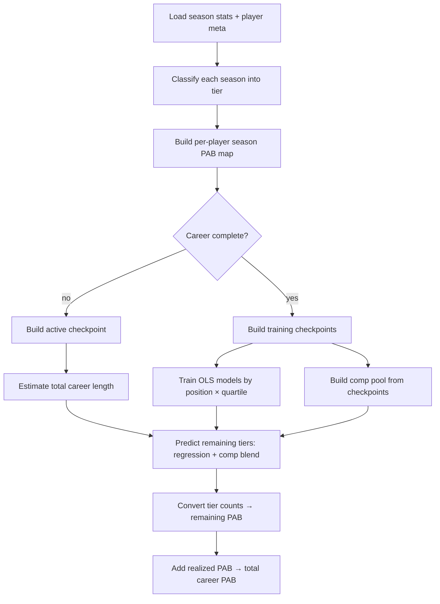

# Phase 11 — Career Projections

> **Status:** design review — edit this doc before implementation.

## Goal

Forecast **remaining valuable tier seasons** for active NFL players, convert those counts to **projected remaining PAB**, and combine with **realized career PAB** (from phase 10) to produce **total career PAB**.

This phase is the **model and library** plus minimal wiring. Full dynasty ranking UI and calibration belong in phase 12.

## Scope

| Included | Excluded (phase 12+) |
|----------|----------------------|
| Checkpoint training data from completed careers | Dynasty rank calibration blend |
| OLS regression on remaining tier counts | Full player valuation / ranking UI |
| Historical comp matching + tuned blend weights | Draft-capital prior for rookies |
| Active career length estimation | Persisting projections in Supabase |
| `runCareerProjections()` orchestrator | Backtest / ablation CLI (optional follow-up) |
| Realized + projected PAB on player detail pages | League-config form on every page |

## Outputs (definitions)

For each active player:

| Field | Meaning |
|-------|---------|
| `realizedCounts` | Elite / star / starter seasons already played |
| `projectedRemainingCounts` | Expected additional elite / star / starter seasons |
| `totalCounts` | `realized + projected` |
| `realizedPab` | `Σ realizedCounts[tier] × tierPabRate[tier]` |
| `projectedRemainingPab` | `Σ projectedRemainingCounts[tier] × tierPabRate[tier]` |
| `totalCareerPab` | `realizedPab + projectedRemainingPab` |

Tier PAB rates come from phase 10 (`computePabRates`, last 6 seasons, league config). Bench tiers contribute **0** PAB.

**Core conversion formula** (same as phase 10):

```
careerPabFromTierCounts(counts, rates) =
  counts.elite × rates.elite
+ counts.star   × rates.star
+ counts.starter × rates.starter
```

Projections are **fractional** tier-season counts (e.g. 0.8 elite seasons). PAB math treats them as expected values.

---

## Pipeline overview



---

## Step 1 — Season classification (reuse phase 10)

For each `fantasy_season_stats` row:

1. Rank all players at that position in that season by fantasy points (scoring style from league config).
2. Assign tier via `classifyRank(rank, thresholds)` — elite / star / starter / bench.
3. Look up position PAB rates; `seasonPab = rates[tier]` (0 for bench).

No new logic here — uses `src/lib/pab/classify-seasons.ts` and `compute-pab.ts`.

---

## Step 2 — Training checkpoints (completed careers only)

A **checkpoint** is a snapshot of a player **after N seasons**, used to learn “given this profile so far, how many elite/star/starter seasons remain?”

### Who counts as “career complete”

```
isCareerComplete(lastSeason, hasRecentStats) =
  lastSeason is not null
  AND (NOT hasRecentStats OR lastSeason ≤ CURRENT_SEASON - 2)
```

- `CURRENT_SEASON` = latest year in the database (default **2025**, updated at import).
- `hasRecentStats` = player has a row in `CURRENT_SEASON` or `CURRENT_SEASON - 1`.
- Gap of **2 years** without stats ⇒ treat as retired.

Training set: completed careers with **≥ 2 seasons** played.

### Checkpoint construction

For each completed career, sort seasons by year. After each season `i` (1-indexed):

| Field | Calculation |
|-------|-------------|
| `yearsPlayed` | `i` |
| `totalSeasons` | total seasons in career |
| `tiersSoFar` | cumulative elite / star / starter counts through season `i` |
| `remainingTiers` | `totalCareerTiers - tiersSoFar` (training target) |
| `peakTier` | max tier ordinal seen so far (elite=4, star=3, starter=2, bench=1) |
| `gamesPlayed` | cumulative games |
| `careerQuartile` | see below |
| `playerAge` | `ageAtSeason(birth_date, seasonYear)` — see below |
| Recent features | see “Recent performance window” |

Each career with `S` seasons produces `S` checkpoints (one per year played).

### Player age (from nflverse `birth_date`)

Imported via migration `005_player_birth_date.sql` and `players.csv` during `npm run import:data`.

```
ageAtSeason(birthDate, seasonYear) =
  seasonYear - birthYear
  minus 1 if birthday falls after Sept 1 (NFL season start)
```

**Fallback** when `birth_date` is null (rare for players with stats):

```
draftAgeProxy = seasonYear - draftYear + 22   // if drafted
else yearsPlayed + 22
```

Helper: `src/lib/player-age.ts`.

### Career quartile

Progress through career as a fraction:

```
progress = yearsPlayed / totalSeasons   (for training: known total)
```

| Quartile | Label | Condition |
|----------|-------|-----------|
| Q1 | early | progress ≤ 0.25 |
| Q2 | mid-early | progress ≤ 0.50 |
| Q3 | mid-late | progress ≤ 0.75 |
| Q4 | late | progress > 0.75 |

Models are trained **per position × quartile**, with fallback to **position-only** if quartile sample &lt; 20.

---

## Step 3 — Recent performance window

**Window:** last **3** seasons (`RECENT_SEASON_WINDOW = 3`).

| Feature | Calculation |
|---------|-------------|
| `recentElite` | elite seasons in window |
| `recentStar` | star seasons in window |
| `recentStarter` | starter seasons in window |
| `recentValuableSeasons` | count of elite + star + starter in window |
| `recentPabRate` | mean `seasonPab` in window |
| `lastSeasonTier` | ordinal of most recent season tier |
| `momentum` | `recentValuableRate - careerValuableRate` |

Where:

```
careerValuableRate = (elite + star + starter so far) / yearsPlayed
recentValuableRate   = recentValuableSeasons / windowLength
```

### Config knob: `recentFeatureScale` (default **0**)

All recent features fed to regression are multiplied by this scale:

```
checkpointFeatures(..., recentScale) =
  [ log_draft_pick,
    is_undrafted,
    years_played,
    elite_so_far, star_so_far, starter_so_far,
    peak_tier,
    games_played,
    player_age,
    recent_elite × recentScale,
    recent_star × recentScale,
    ... (all recent fields × recentScale) ]
```

**FFB3 ablation result:** `recentFeatureScale = 0` performed best — career totals and peak tier dominate; recent form is ignored in regression. Keep **0** unless you want to re-run backtests.

---

## Step 4 — OLS regression models

### Features (16 total)

| # | Feature | Notes |
|---|---------|-------|
| 1 | `log(draftPick)` | undrafted → `log(256)` |
| 2 | `isUndrafted` | 0/1 |
| 3 | `yearsPlayed` | |
| 4–6 | `elite/star/starter` so far | |
| 7 | `peakTier` | ordinal 0–4 |
| 8 | `gamesPlayed` | cumulative |
| 9 | `playerAge` | from `birth_date`; fallback draft-age proxy |
| 10–16 | recent features | scaled by `recentFeatureScale` |

### Targets

Three separate models per (position, quartile) group:

- `remainingTiers.elite`
- `remainingTiers.star`
- `remainingTiers.starter`

### Training rules

- Minimum **20** checkpoint rows to fit a model group; else fall back to position-wide model.
- Minimum `n ≥ k + 8` rows for OLS (`k` = feature count) or model is `null` → predict **0**.

### How OLS regression works (training)

For each (position, quartile, tier) group — e.g. RB, Q2, **star** — we have many historical checkpoints. Each checkpoint is one row:

| Input | Output (target) |
|-------|-----------------|
| 16 features from that checkpoint | `remainingTiers.star` that player actually had |

**1. Normalize features (z-score)**

For each feature column `j` across all training rows:

```
μⱼ = mean(feature_j)
σⱼ = std(feature_j)   (or 1 if σⱼ = 0)
x̃ᵢⱼ = (xᵢⱼ - μⱼ) / σⱼ
```

Store `μⱼ` and `σⱼ` — needed at prediction time.

**2. Add intercept**

Each row becomes a design vector: `[1, x̃₁, x̃₂, … x̃₁₆]` (17 values).

**3. Fit coefficients (ordinary least squares)**

Find coefficients `β` that minimize squared error:

```
minimize  Σᵢ (yᵢ - β₀ - Σⱼ βⱼ·x̃ᵢⱼ)²
```

Solved via normal equations (`XᵀX · β = Xᵀy`). Result: intercept `β₀` plus one weight per feature.

**4. Store the model**

```
OlsModel = { coefficients β, featureMeans μ, featureStds σ, r2 }
```

Three models per group (elite, star, starter) — same features, different `y`.

### How OLS regression works (prediction)

For an active player checkpoint, build the same 16 features, normalize with **training** μ and σ:

```
x̃ⱼ = (feature_j - μⱼ) / σⱼ
ŷ = β₀ + Σⱼ βⱼ·x̃ⱼ
ŷ = max(0, ŷ)    // negative predictions clamped to zero
```

```
regressionRemaining = {
  elite:   predictOls(eliteModel,   features),
  star:    predictOls(starModel,    features),
  starter: predictOls(starterModel, features),
}
```

**Example:** A 4th-year WR in Q2 might get `regressionRemaining = { elite: 0.1, star: 0.8, starter: 1.2 }` — fractional expected seasons still to come.

---

## Step 5 — Historical comp matching

Find similar **completed-career checkpoints** at the same career stage; use their actual `remainingTiers` as a second estimate.

### Comp pool

Every training checkpoint is a comp candidate (same fields as query + known `remainingTiers`).

### Tight match (preferred)

Same position, same quartile, and:

| Criterion | Tolerance |
|-----------|-----------|
| `yearsPlayed` | ±1 |
| `elite/star/starter` so far | each ±1 |
| Draft | both undrafted, **or** draft pick within **24** slots |

### Loose match (fallback if tight count &lt; 5)

Same position, `yearsPlayed` ±2, undrafted status matches (draft pick ignored).

### Comp expectation

```
compRemaining = mean(remainingTiers) across matches
```

If no matches: `{ elite: 0, star: 0, starter: 0 }`.

`MIN_COMP_SAMPLES = 5` — switch from tight to loose below this.

---

## Step 6 — Regression / comp blend

Step 6 does **not** run new regression math. It combines two estimates that are already computed:

| Symbol | Source | Meaning |
|--------|--------|---------|
| `regression[tier]` | Step 4 OLS | Model prediction of remaining elite/star/starter seasons |
| `comp[tier]` | Step 5 comps | Mean of what similar historical players actually had left |
| `compWeight` | Table below | How much to trust comps vs the model (0 = model only, 1 = comps only) |

### Blend formula

For each tier separately:

```
predictedTiers[tier] = max(0,
  (1 - compWeight) × regression[tier]
+ compWeight         × comp[tier]
)
```

### Worked example (WR, Q4, `compWeight = 1.0`)

Suppose Step 4 and Step 5 produced:

| Tier | `regression` | `comp` |
|------|-------------|--------|
| elite | 0.2 | 0.0 |
| star | 0.5 | 0.3 |
| starter | 0.8 | 1.1 |

With `compWeight = 1.0` (comps only — FFB3 default for late-career WR):

```
predictedTiers = { elite: 0.0, star: 0.3, starter: 1.1 }
```

With `compWeight = 0.25` (e.g. WR Q3):

```
elite   = 0.75 × 0.2 + 0.25 × 0.0 = 0.15
star    = 0.75 × 0.5 + 0.25 × 0.3 = 0.45
starter = 0.75 × 0.8 + 0.25 × 1.1 = 0.875
```

### Convert blended tiers to PAB (happens after Step 6)

```
projectedRemainingPab = Σ tier  predictedTiers[tier] × tierPabRate[tier]
```

Using default 16-team PPR rates as an example: if `rates.star = 80` and `rates.starter = 40`, the Q3 WR above gets:

```
remainingPab = 0.15×eliteRate + 0.45×80 + 0.875×40   (elite rate omitted if 0.15 × rate)
```

### Blend tuning grid (10% steps)

Search space for `compWeight`:

```
0.0, 0.1, 0.2, 0.3, 0.4, 0.5, 0.6, 0.7, 0.8, 0.9, 1.0
```

FFB3 used **25% steps** (`0, 0.25, 0.5, 0.75, 1`). FFB4 will use **10% steps** for finer resolution.

**Rerun required:** yes. The table below is a starting point from FFB3’s coarser backtest — not guaranteed optimal on the 10% grid. During phase 11, run `scripts/backtest-projections.ts` (80/20 player train/test split) and pick the blend with lowest **MAE** (mean absolute error in remaining PAB) per position × quartile.

How the backtest works:

1. Train regression on 80% of completed careers; hold out 20% for test.
2. For each test checkpoint, try all 11 blend values.
3. For each (position, quartile) bucket, select the blend with lowest average `|predictedPab - actualRemainingPab|`.
4. Copy the winning values into `projection-blends.ts`.

Cost: ~2× FFB3 sweep time (11 blends vs 5) — still seconds to a few minutes locally.

### Starting table (FFB3 @ 25% grid — replace after FFB4 backtest)

| Position | Q1 | Q2 | Q3 | Q4 |
|----------|----|----|----|----|
| QB | 0.50 | 0.25 | 0.50 | 0.00 |
| RB | 0.00 | 0.25 | 0.75 | 0.00 |
| WR | 0.00 | 0.00 | 0.25 | 1.00 |
| TE | 0.25 | 0.00 | 0.25 | 0.25 |

Some cells may stay the same after rerun (values already on a 10% boundary). Others may shift — e.g. RB Q3 at 0.75 might become 0.70 or 0.80 if error is flatter between neighbors.

---

## Step 7 — Active players (projection targets)

### Exclusions

| Rule | Reason |
|------|--------|
| Career complete | already in training set, not projected |
| 0 seasons | no data |
| Current rookie | `firstSeason = CURRENT_SEASON` and `lastSeason = CURRENT_SEASON` and ≤1 season — too little signal |

### Estimated total career length (for quartile on active players)

Active players do not know `totalSeasons` yet. Estimate before building checkpoint:

```
medianFloor = max(medianCareerLength[position], yearsPlayed + 2)

ageBasedTotal = yearsPlayed + max(1, retireAge - playerAge)
  retireAge = POSITION_RETIRE_AGE[position] + eliteBonus + recentBonus

productivePath = yearsPlayed + (recent affects length ? 5 : 2)  [if ≥2 recent valuable seasons]
recentElitePath  = yearsPlayed + 8  [if recent elite + peak elite, when recent affects length]

estimatedTotal = max(medianFloor, ageBasedTotal, productivePath, recentElitePath)
```

**Position retire ages (base):** QB 38, RB 30, WR 34, TE 35.

**Elite bonus:** +3 years if `peakTier ≥ 4`, else +1 if `peakTier ≥ 3`.

### Config knob: `recentAffectsCareerLength` (default **false**)

When **false** (FFB3 default), `recentBonus`, `productivePath`, and `recentElitePath` are disabled — career length uses **median + age only**.

Active checkpoint uses `estimatedTotal` for quartile; `remainingTiers` target is empty (prediction only).

---

## Step 8 — PAB assembly

```
projectedRemainingPab = careerPabFromTierCounts(predictedTiers, rates)
realizedPab           = careerPabFromTierCounts(realizedCounts, rates)
totalCareerPab        = realizedPab + projectedRemainingPab
```

Position PAB rates: same league config as `/pab` (default 16-team PPR).

---

## Default config (`PROJECTION_CONFIG`)

Starting values from FFB3 ablation — **change here before coding**:

```ts
{
  recentFeatureScale: 0,           // 0 = ignore recent form in regression
  recentAffectsCareerLength: false, // age + median only for active length
  dynastyCalibrationWeight: 0,     // phase 12; disabled in phase 11
}
```

---

## Prerequisites

- Migration `005_player_birth_date.sql` applied (`npm run db:push`)
- Re-import data so `players.birth_date` is populated (`npm run import:data`)

## Proposed file layout

```
src/lib/player-age.ts      — ageAtSeason (already added)
src/lib/projections/
  types.ts              — ProjectionCheckpoint, PlayerProjection, config
  projection-config.ts  — PROJECTION_CONFIG knobs
  checkpoints.ts        — build checkpoints + active checkpoint
  career-stage.ts       — quartile, estimated career length
  recent-performance.ts — 3-season window features
  regression.ts         — OLS fit/predict (or shared util)
  projection-models.ts  — train + predict remaining tiers
  comp-matching.ts      — tight/loose comp search
  projection-blends.ts  — BACKTEST_TUNED_COMP_WEIGHT table
  projection-predict.ts — blend regression + comp → PAB
  career-complete.ts    — active vs complete, rookie skip
  run-projections.ts    — orchestrator (loads data, returns Map)
```

Re-exports / thin wrappers over `src/lib/pab/` for classification and rates — no duplication of tier math.

---

## UI (minimal, phase 11)

**Player detail page** (`/players/[id]`):

- Show **realized career PAB** (sum of historical tier values)
- Show **projected remaining PAB** (model output)
- Show **total career PAB**
- Optional breakdown: elite / star / starter counts (realized vs projected)
- Footnote: default league config (16-team PPR); link to `/pab`

**Not in phase 11:** sorting `/players` by total PAB, dynasty-adjusted values, league config picker on player pages.

---

## Implementation plan (sub-commits)

| Step | Commit label | Deliverable |
|------|--------------|-------------|
| 11.a | types, config, checkpoints, career-stage, recent-performance, regression | Training data pipeline + unit-testable pure functions |
| 11.b | models, comp-matching, blends, predict, run-projections | End-to-end projection for active players |
| 11.c | player page PAB section + phase doc / roadmap update | Visible output |

Squash to one `Phase 11:` commit on `main` when done.

---

## Open questions (edit before implementation)

1. **`recentFeatureScale`** — keep at **0** (FFB3 winner) or enable recent form (e.g. 0.5)?
2. **`recentAffectsCareerLength`** — keep **false** or let recent production extend RB/QB estimates?
3. **Comp blend table** — use 10% grid + rerun FFB4 backtest (decided); FFB3 table is placeholder until backtest runs.
4. **Rookie handling** — skip current-year rookies only, or also second-year players with one season?
5. **League config on player pages** — hardcode default 16-team PPR for phase 11, or read from shared config/cookie later?
6. **Backtest script** — include `scripts/backtest-projections.ts` in phase 11 or defer as chore?
7. **Dynasty calibration** — confirm stays **phase 12** with weight 0 here?

---

## Acceptance criteria

- [ ] Completed careers produce checkpoints; training runs without error on full DB
- [ ] Active non-rookie players receive projected remaining tier counts and PAB
- [ ] Realized PAB on player page matches manual sum from classified seasons (default config)
- [ ] Config knobs documented and centralized in `projection-config.ts`
- [ ] Phase 12 scope unchanged (no dynasty blend, no valuation rankings page)

## Git

Branch: `feature/11-projections`

## References

- Phase 10 PAB: [10-pab-calculations.md](./10-pab-calculations.md)
- FFB3 implementation (reference only): `project-ffb3/src/lib/valuation/`
